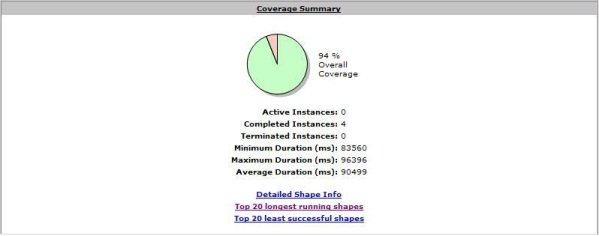
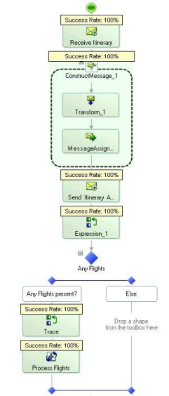
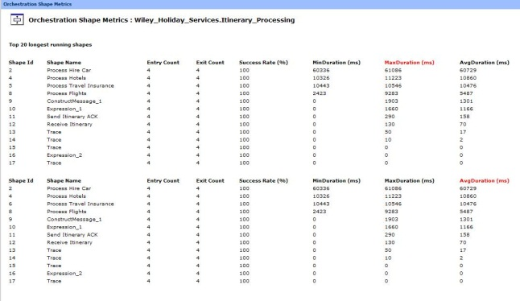

**Project Description**

Creates CHM report files illustrating the level of coverage for specified BizTalk orchestrations. This tool can be run to gain a consolidated view of orchestration tracking data for a specified period of time to help developers get an idea of how their orchestrations are being processed and how much coverage they are getting in their testing. In addition to simple coverage information the data presented helps to identify latency and code path exceptions by highlighting long running and error prone orchestration shapes which is key to effective performance testing.

###Quick Usage guide

The image below shows the home screen of the app, after you ensured that your connexion informations are correct you can using it right away, in order to generate a report : 
 
1 - +Click on "List the applications deployed" button, this will retrieve all the BizTalk applications deployed on your BizTalk platform 
2 - Then select the applications you are interrested by (i.e the apps containing the orchestration(s) you want to profile)
3 - +Click on the "Get Selected Apps' Orchestrations" button
4 - Then check the orchestrations you want to generate a report for 
5 - Select either a date interval or specify exactly the orchestration instances you want to profile (instanceId1, instanceId2...)

And finally click on the generate report button

### Current Release
The current release is **v2.0**, it has been tested against BizTalk 2013/R2 and BizTalk 2016

### Roadmap
Point releases will be made as frequently as possible to fix reported bugs. New functionalities will be added soon so stay tuned.

## Screenshots

The image below shows a sample of the coverage summary, at a glance you can see the percentage of overall coverage acheived upon an individual orchestration, if all of the shapes are _touched_ as part of your orchestration then you will acheive 100% coverage, common reasons for not covering all shapes with an orchestration are not running tests that stress the error paths of your solution.   This coverage summary also provides you metrics around execution duration of your orchestration easily identifying orchestrations that take a long time to execute.

The image below shows the orchestration coverage in detail, shapes highlighted in green have been executed as part of your last test pass and any shapes not executed will be highlighted in red.  This enables you to easily understand what parts of your solution have been tested and which parts have not and adjust your testing as necessary.

As part of the profiler report you can see the "Top 10 Least Successsfull" shapes and the "Top 10 Longest Running" shapes, understanding where time is being spent inside your orchestration is key to effective performance testing and has been proven on a number of instances to pinpoint poor orchestration design and coding which when resolved has dramatically increased overall performance.   The key is to understanding exactly where time is being spent and this tool offers a no-code view into your running system.

