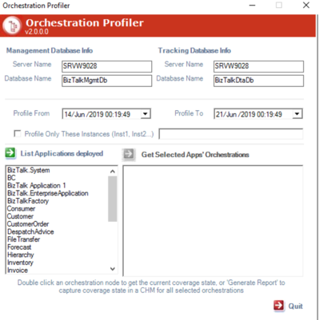

### BizTalk Orchestration Profiler v2.0

    
This project is a tool to profile your BizTalk orchestration, it is based on an old powerful tool with the same name that wasn't working anymore since BizTalk 2009.

**Enhancements :**

* Added the possibility to profile only a set of particular orchestration instances identified by their InstanceID
* Added BizTalk application filters (the tool wasn't usable when the BizTalk platform has many orchestrations deployed as you can imagine)
* Fixed timezone issues (The tool wasn't working when the system and SQL server were on two different timezones)

**How can i use it ?**  
Check the [docs section](https://github.com/mahieddine/biztalk-orchestration-profiler/blob/master/Docs/README.md) 

**Contributions:**  
We love contributions! There's lots to do, so why not chat with us about what you're interested in doing? Please star/follow the project and let us know about your plans.

Documentation, bug reports, pull requests, and all other contributions are welcome!

To suggest a feature or report a bug: https://github.com/mahieddine/biztalk-orchestration-profiler/issues

If you want to help me keep this project maintained 🙂

